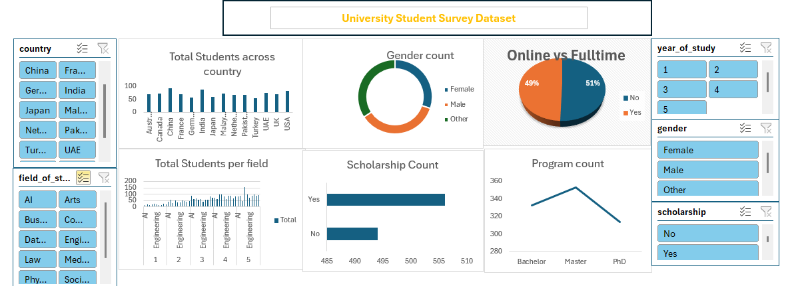
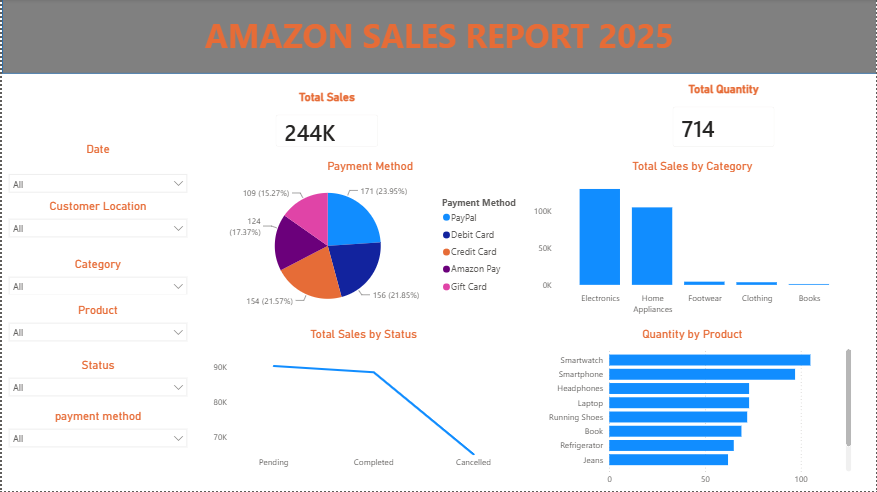
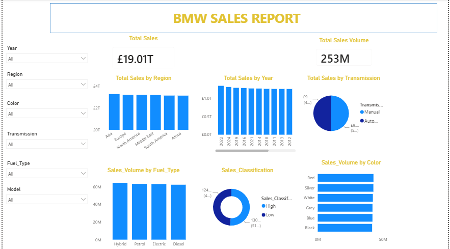

# Data Analytics Project

# Project 1

**Title:** [C&M_MOTORS DATA](https://github.com/Osyalaezi/github.io-osyalaezi/blob/main/project1.xlsx)

**Tools Used:** Microsoft Excel (Filters,Slicers,pivot charts,conditional formatting)

**Project Description:**

Project Description: This project involved analysing data of C & M Motors to identify trends and patterns in sales performance for 2021. It is designed to provide a comprehensive overview of key performance metrics. This dashboard allows stakeholders to easily monitor and analyze the company’s performance across different  Dealer regions, Transmission type,Body Style and across companies.

The dashboard includes the following features:

Total Sales per company: Visual representation of Sales broken down by each company and  body style of cars.

Total Sales by Body style: A breakdown of the total sales by body style, providing insights into sales trends over time.

TOP N Cars models sold: Displays cars that is sold most, allowing for easy comparison of cars and model that move the market through out the year.

Total Sales by Country: Highlights the total sales generated in each country, showcasing the performance in different companies.

Additionally, the dashboard includes interactive slicers and timelines for:

Model: Filter the data to view performance for a specific Body style,transimission type,colour,region and company.

Country: Focus on specific countries to analyze regional performance.

Product: Drill down into the performance of individual cars.

**Key findings:**

Regional Profitability: Identified the most profitable company and highlighted regions where performance could be improved.

Seasonal Trends: Revealed patterns in sales and profit that correspond with seasonal events, allowing for more strategic planning.

Top-Performing Products: Highlighted which car models are driving the most revenue and profit, aiding in inventory and marketing decisions.

Sales Volatility: Analyzed sales fluctuations to understand market dynamics and adjust business strategies accordingly.

This dashboard serves as a crucial tool for the car company’s management team, providing clear, actionable insights that drive informed decision-making and strategic planning.

**Dashboard Overview:**

# Project 2

**Title:** [University Students Survey Dataset](https://github.com/Osyalaezi/github.io-osyalaezi/blob/main/university%20students%20dataset.xlsx)

**Tools Used:** Microsoft Excel (Filters,Slicers,pivot charts,conditional formatting)

**Project Description:**

Project Description: This project involved analysing data of University students to identify trends and patterns in different fields. It is designed to provide a comprehensive overview of key performance metrics. This dashboard allows stakeholders to easily monitor and analyze University Students across different Field of study,program count,schoolarship count,online or fulltime,gender and across countries.

The dashboard includes the following features:

Total Students across countries: Visual representation of Students broken down by number of students per country.

Total Students across fields and year of study: A breakdown of the total number of students by Field and year of study, providing insights on number of students per field, per year of study over time.

Total Students on Schoolarship: A breakdown of the total number of students on schoolarship, providing insights on number of students on schoolarship trend over time.

Total Student by program count: Highlights the total students generated in each program, showcasing the program with the number of students.

Additionally, the dashboard includes interactive slicers and timelines for:

Gender: Filter the data to view the number of different genders in each field and the university as a whole.

Country: Focus on specific countries to analyze number of students.

online vs fulltime: Drill down to the number and percentage of online and fulltime student.

**Key findings:**

**Dashboard Overview:**

# Project 3

**Title:**Football Data Extraction

**SQL Code:**[Footballdata-Sql interogation](https://github.com/Osyalaezi/github.io-osyalaezi/blob/main/Footballdata.SQL)

**SQL Skills Used:**

Data Retrieval (SELECT): Queried and extracted specific information from the database.

Data Aggregation (SUM, COUNT): Calculated totals, such as sales and quantities, and counted records to analyze data trends.

Data Filtering (WHERE, BETWEEN, IN, AND): Applied filters to select relevant data, including filtering by ranges and lists.

Data Source Specification (FROM): Specified the tables used as data sources for retrieval

**Project Description:**

**Technology used: SQL server**

# Project 4

**Title:**Customer_order Extraction

**SQL Code:**[Customer_order-Sql interogation](https://github.com/Osyalaezi/github.io-osyalaezi/blob/main/Customer_orders.Sql)

**SQL Skills Used:**
Data Retrieval (SELECT): Queried and extracted specific information from the database.

Data Aggregation (SUM, COUNT): Calculated totals, such as sales and quantities, and counted records to analyze data trends.

Data Filtering (WHERE, BETWEEN, IN, AND): Applied filters to select relevant data, including filtering by ranges and lists.

Data Source Specification (FROM): Specified the tables used as data sources for retrieval

**Project Description:**

**Technology used: SQL server**

# Project 5

**Title:**[Amazonsales25](https://github.com/Osyalaezi/github.io-osyalaezi/blob/main/project1.pbix)

**Tools Used:**power Bi

**Project Description:**

**Key findings:**

**Dashboard Overview:**

# Project 6

**Title:**[BMW_Sales_Report](https://github.com/Osyalaezi/github.io-osyalaezi/blob/main/project2.pbix)

**Tools Used:**power Bi

**Project Description:**

**Key findings:**

**Dashboard Overview:**

